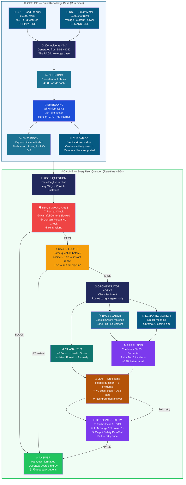

# SGEIA — RAG Pipeline Architecture

> **VS Code:** Install **"Mermaid Preview"** extension → open this file → press `Ctrl+Shift+V`

---

## Simple Flow Overview

```
CSV Datasets → Chunking → Embedding → Indexing → ChromaDB
                                                      ↓
User Question → Guardrails → Cache → Orchestrator → Hybrid Search → LLM → DeepEval → Answer
```

---

## Full RAG Pipeline Diagram



---

## One-Line Summary Per Step

| Step | What | One Line |
|------|------|----------|
| 1 | Load CSV | Read DS1 60K + DS2 2M + Incidents 200 into memory |
| 2 | Chunking | Each incident description = 1 chunk (40-80 words) |
| 3 | Embedding | Convert text to 384-number vector using all-MiniLM-L6-v2 |
| 4 | BM25 Index | Build keyword index for fast exact matching |
| 5 | ChromaDB | Store vectors on disk for cosine similarity search |
| 6 | Guardrails | Block harmful/off-topic, mask PII before pipeline |
| 7 | Cache | Return instant answer if same question seen before |
| 8 | Orchestrator | Decide which agents to run based on question type |
| 9 | BM25 Search | Find incidents with exact zone/ID/equipment keywords |
| 10 | Semantic Search | Find incidents with similar meaning using vectors |
| 11 | ML Analysis | XGBoost gives health score, Isolation Forest flags anomalies |
| 12 | RRF Fusion | Combine BM25 + Semantic and pick best 8 incidents |
| 13 | LLM | Read all context and write grounded answer in plain English |
| 14 | DeepEval | Check faithfulness, judge quality, scan output safety |
| 15 | Answer | Show result with DeepEval scores and feedback buttons |

---

## Key Numbers

| Item | Value |
|------|-------|
| DS1 dataset | 60,000 rows |
| DS2 dataset | 2,000,000 rows |
| Incidents indexed | 200 records |
| Embedding size | 384 dimensions |
| Top-K results | 8 incidents |
| Cache threshold | cosine > 0.97 |
| Judge pass score | >= 3 out of 5 |
| Faithfulness pass | >= 50% |
| LLM response time | ~2 seconds (Groq) |
| Dashboard refresh | every 60 seconds |

---

*SGEIA · Tejeswari S K · Prodapt AFDE Capstone · May 2026*
