# SGEIA — System Architecture Diagram

> **How to view:** Install the **"Mermaid Preview"** extension in VS Code, then press `Ctrl+Shift+P` → "Mermaid Preview: Open Preview"

---

## Full Pipeline Flow

```mermaid
flowchart TD
    %% ─── USER LAYER ───────────────────────────────────────────────────────
    U([👤 User / Grid Operator\nTypes question in plain English])

    %% ─── INPUT GUARDRAILS ─────────────────────────────────────────────────
    subgraph G1["🛡️ INPUT GUARDRAILS  ← blocks bad queries before they enter"]
        G1A["① Format Check\nLength 5–1000 chars, not empty"]
        G1B["② Harmful Content\nViolence / threats / illegal → BLOCKED"]
        G1C["③ Domain Relevance\nMust be about power grid / energy"]
        G1D["④ PII Masking\nPhone → PHONE · Email → EMAIL · GPS → GPS_MASKED\nUses Microsoft Presidio + regex"]
        G1A --> G1B --> G1C --> G1D
    end

    %% ─── CACHE LOOKUP ─────────────────────────────────────────────────────
    subgraph CACHE["⚡ CACHE LOOKUP  ← skip full pipeline if seen before"]
        CA["ChromaDB query_cache\nCosine similarity > 0.97 → return instantly\nSaves time for repeated questions"]
    end

    %% ─── ORCHESTRATOR ─────────────────────────────────────────────────────
    subgraph ORC["🧩 ORCHESTRATOR AGENT  ← decides which agents to activate"]
        OR["LLM Query Router\nClassifies intent:\nincident · stability · smart_meter · cross_domain · out_of_scope\nRoutes to ONLY the agents needed → faster + accurate"]
    end

    %% ─── DATA LAYER ───────────────────────────────────────────────────────
    subgraph DATA["📦 DATA SOURCES  ← two datasets covering both sides of the grid"]
        DS1["DS1 — Smart Grid Stability\n60,000 rows · UCI dataset\nColumns: tau1-4, p1-4, g1-4, stabf, stab\ngrid_frequency, region, equipment_type\noutage_event, transformer_status\n\nSUPPLY SIDE: generator & transmission behaviour"]
        DS2["DS2 — Household Power Consumption\n2,000,000 rows · real meter readings\nColumns: voltage, current, power_consumption\nreactive_power, sub_metering_kitchen/laundry/hvac\ndemand_load, outage_event, region\n\nDEMAND SIDE: what consumers actually use"]
        INC["Incident Knowledge Base\n200 synthetic incidents\nGenerated from DS1 (grid events) + DS2 (meter events)\nIndexed in ChromaDB + BM25"]
    end

    %% ─── RAG PIPELINE ─────────────────────────────────────────────────────
    subgraph RAG["🔍 RAG PIPELINE  ← finds relevant past incidents"]
        direction TB
        R1["CHUNKING\nEach incident = 1 chunk ≈ 50 words\nNo splitting needed — already optimal size"]
        R2["EMBEDDING\nall-MiniLM-L6-v2 model\n384-dim vectors · runs on CPU · no internet needed\nWhy: corporate proxy blocks cloud embedding APIs"]
        R3["INDEXING\nBM25 keyword index ← exact matches\nChromaDB vector index ← semantic similarity"]
        R4["VECTOR STORAGE\nChromaDB saves 200 vectors to disk\nPersists across server restarts"]
        R5["HYBRID SEARCH at query time\nBM25: finds Zone_A, INC-042, transformer\nChromaDB: finds similar incidents by meaning\nRRF Fusion: combines both → top 8 results\n\nWhy hybrid? BM25 catches exact IDs.\nSemantic catches concepts. Together = best recall."]
        R1 --> R2 --> R3 --> R4
        INC --> R1
        R4 --> R5
    end

    %% ─── ML AGENTS ────────────────────────────────────────────────────────
    subgraph ML["🤖 ML AGENTS  ← machine learning models analyse the data"]
        MA["Grid Stability Agent\nXGBoost Classifier on DS1\nPredicts: stable / unstable\nOutputs: probability + health score 0-100\nSHAP values: explains WHICH feature caused instability\n\nWhy XGBoost not Neural Networks?\nGives SHAP explanations. Handles 63.8%/36.2% imbalance.\nFast training. Operators need explainability."]
        MB["Smart Meter Agent\nIsolation Forest on DS2\nDetects anomalous consumption patterns\nNo labels needed — unsupervised learning\n\nWhy Isolation Forest?\nDS2 has no pre-labelled anomalies.\nScales to 2M rows. Gives anomaly score per row."]
        MC["Failure Analysis Agent\nSynthesises outputs from retrieval + stability + meter agents\nIdentifies root cause chain:\ntelemetry signal → instability → incident type"]
    end

    %% ─── SCADA ────────────────────────────────────────────────────────────
    subgraph SCADA["📡 SCADA INTEGRATION  ← real-time telemetry ingest"]
        SC["POST /api/scada/ingest\nAccepts raw RTU/PLC telemetry\ntau1-4, p1-4, g1-4, region, equipment_type\nRuns XGBoost → predicts stability\nWrites to live_telemetry.csv buffer\n\nSimulates SCADA RTU → REST adapter\nIn production: OPC-UA → REST bridge"]
    end

    %% ─── LIVE SIMULATOR ───────────────────────────────────────────────────
    subgraph SIM["⏱️ LIVE TELEMETRY SIMULATOR  ← replays DS1 every 30 seconds"]
        SI["Replays real DS1 rows every 30s\nstabf / stab = BLANK (ground truth hidden)\nXGBoost predicts them in real-time\nMimics how live SCADA data would arrive\nHealth score on dashboard = real ML output"]
    end

    %% ─── LLM ──────────────────────────────────────────────────────────────
    subgraph LLM["💬 LLM PROCESSING  ← generates the natural language answer"]
        L1["Groq llama-3.1-8b-instant\nPrimary — free, ~2s response, confirmed working\n\nProdapt Gateway gpt-4o-mini\nFallback 1 — corporate gateway with SSL bypass\n\nLangChain ModelRouter\nFallback 2 — Gemini → Groq → local\n\nReceives: question + 8 incidents + DS1 stats + DS2 stats\nOutputs: grounded natural language answer citing real data"]
    end

    %% ─── DEEPEVAL ─────────────────────────────────────────────────────────
    subgraph DEVAL["🔬 DEEPEVAL QUALITY GATES  ← ensures answer is trustworthy"]
        D1["① Faithfulness Check\nDoes answer cite real numbers from retrieved data?\nScore: 0.0–1.0 (shown in grey below answer)\nFail = answer was generic / hallucinated"]
        D2["② LLM-as-Judge\nSecond AI scores the answer 1–5\nThreshold ≥ 3/5 required to pass\nShown in grey below answer"]
        D3["③ Output Safety\nBlocks: harmful content, system prompt leaks, PII\nShown in grey below answer\nFail → answer replaced with safe fallback"]
        D1 --> D2 --> D3
    end

    %% ─── CACHE STORE ──────────────────────────────────────────────────────
    CS["💾 CACHE STORE\nHigh-quality answers (score ≥ 0.5) saved to ChromaDB\nNext identical question → instant response\nOperator 👍 rating also triggers cache store"]

    %% ─── FEEDBACK LOOP ────────────────────────────────────────────────────
    subgraph FB["🔄 FEEDBACK LOOP  ← operator ratings improve the system over time"]
        F1["👍 Helpful → rating=5\nAnswer cached in ChromaDB\nBoosts similar questions in future"]
        F2["👎 Not helpful → rating=2\nLogged to feedback_log.csv\nIdentifies query types that need improvement"]
        F3["POST /api/feedback\nStores: query, answer, rating, helpful, comment\nGET /api/feedback/summary → avg score, helpful %"]
    end

    %% ─── OUTPUT ───────────────────────────────────────────────────────────
    OUT(["✅ Answer to Operator\nGrounded in real data\nDeepEval scores shown in grey:\n🔬 Faithfulness · ⚖️ LLM Judge · 🔒 Output Safety\n👍 👎 feedback buttons below"])

    %% ─── DASHBOARD ────────────────────────────────────────────────────────
    subgraph DASH["📊 LIVE DASHBOARD  ← 12 widgets, refreshes every 30 seconds"]
        DA["Grid Health Score · Active Incidents · Zone Status Map\nStability Trend · Frequency Monitor · Voltage Health\nDemand vs Capacity · Equipment Status · Anomaly Feed\nAgent Activity · Recommendations · Incident Breakdown"]
    end

    %% ─── CONNECTIONS ──────────────────────────────────────────────────────
    U --> G1
    G1D --> CACHE
    CA -- "Cache HIT → skip pipeline" --> OUT
    CA -- "Cache MISS → run pipeline" --> ORC
    ORC --> RAG
    ORC --> ML
    DS1 --> MA
    DS2 --> MB
    SC --> SIM
    SIM --> DA
    R5 --> MC
    MA --> MC
    MB --> MC
    MC --> LLM
    L1 --> DEVAL
    D3 --> CS
    D3 --> OUT
    OUT --> FB
    FB --> CACHE
    DASH --> U

    %% ─── STYLES ───────────────────────────────────────────────────────────
    style U          fill:#065A82,color:#fff,stroke:#065A82
    style OUT        fill:#22C55E,color:#fff,stroke:#22C55E
    style G1         fill:#FEF2F2,stroke:#EF4444
    style CACHE      fill:#FFFBEB,stroke:#F59E0B
    style ORC        fill:#EFF6FF,stroke:#3B82F6
    style DATA       fill:#F0FDF4,stroke:#22C55E
    style RAG        fill:#EFF6FF,stroke:#065A82
    style ML         fill:#F5F3FF,stroke:#8B5CF6
    style SCADA      fill:#ECFDF5,stroke:#10B981
    style SIM        fill:#ECFDF5,stroke:#10B981
    style LLM        fill:#FFF7ED,stroke:#F59E0B
    style DEVAL      fill:#FDF4FF,stroke:#A855F7
    style FB         fill:#F0FDF4,stroke:#22C55E
    style DASH       fill:#EFF6FF,stroke:#1C7293
    style CA         fill:#FEF9C3,stroke:#CA8A04
    style CS         fill:#FEF9C3,stroke:#CA8A04
```



---

## Quick Reference — What Each Component Does

| Component | What it does | Why this approach |
|---|---|---|
| **Input Guardrails** | Blocks harmful/off-topic queries, masks PII | Grid operations are critical infrastructure — must filter bad inputs |
| **Cache Lookup** | Returns instant answer if same question asked before | Avoids re-running expensive pipeline for repeated queries |
| **Orchestrator** | Routes to only the agents needed | Different questions need different agents — saves time and improves accuracy |
| **DS1** | Supply-side grid stability data | Tells us IF the grid is stable and WHY (physics features) |
| **DS2** | Demand-side smart meter data | Tells us WHAT consumers use and WHERE anomalies occur |
| **Chunking** | Breaks incidents into searchable pieces | Each incident = 1 chunk (50 words) — optimal embedding size |
| **Embedding** | Converts text to 384-dim vectors | all-MiniLM-L6-v2 runs offline (proxy blocks cloud APIs) |
| **BM25** | Keyword search | Catches exact IDs like Zone_A, INC-042, transformer |
| **ChromaDB** | Semantic vector search | Finds similar incidents even with different words |
| **RRF Fusion** | Combines BM25 + ChromaDB results | Better recall than either search method alone |
| **XGBoost** | Stability classifier on DS1 | Gives SHAP explanations — operators need to know WHY |
| **Isolation Forest** | Anomaly detector on DS2 | Unsupervised — no labels needed for 2M rows |
| **SCADA Endpoint** | Accepts real-time RTU telemetry | Simulates live SCADA → REST integration |
| **Groq LLM** | Generates natural language answer | Fast (2s), free, confirmed working on Prodapt network |
| **DeepEval** | Scores faithfulness, judge, safety | Prevents hallucinated or harmful answers reaching operators |
| **Feedback Loop** | Operators rate answers 👍👎 | Improves retrieval over time — high-rated answers get cached |

---

## Dataset Column Mapping

```
DS1 columns used:
  tau1, tau2, tau3, tau4  → reaction time constants  (XGBoost features)
  p1, p2, p3, p4          → power balance per node   (XGBoost features)
  g1, g2, g3, g4          → price elasticity         (XGBoost features)
  stabf                   → stable/unstable label    (XGBoost target)
  stab                    → stability margin          (XGBoost regressor target)
  grid_frequency          → Hz reading               (added column)
  region                  → Zone_A/B/C/D             (added column)
  equipment_type          → device type              (added column)
  transformer_status      → health status            (added column)
  outage_event            → event type               (added column)
  timestamp               → when it happened         (added column)

DS2 columns used:
  voltage                 → meter voltage reading    (Isolation Forest + DS2 agent)
  current                 → ampere reading           (Isolation Forest)
  power_consumption       → total kW used            (Isolation Forest)
  reactive_power          → kVAR (non-useful power)  (Isolation Forest)
  sub_metering_kitchen    → kitchen appliance Wh     (anomaly detection)
  sub_metering_laundry    → laundry appliance Wh     (anomaly detection)
  sub_metering_hvac       → heating/cooling Wh       (anomaly detection)
  demand_load             → total demand             (added column)
  region                  → grid zone mapping        (added column)
  outage_event            → tagged events            (added column)
```
